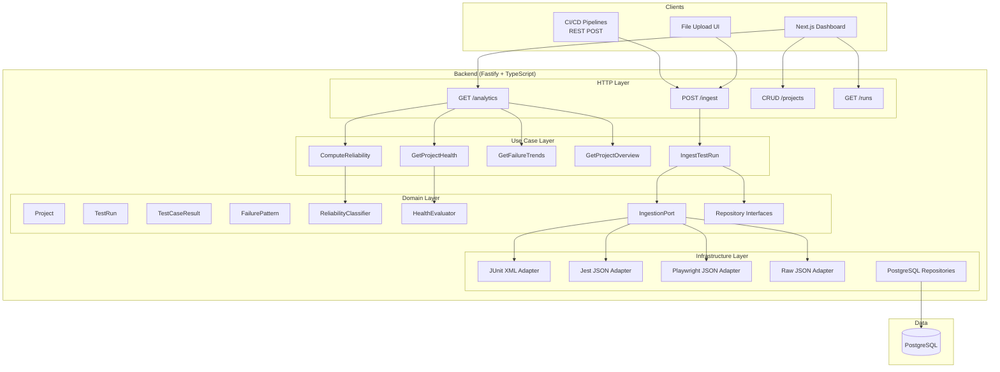
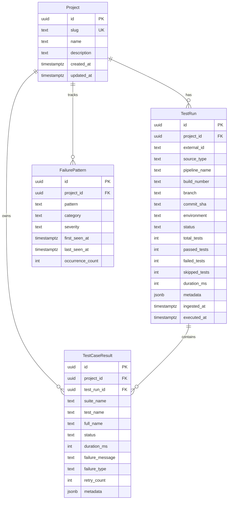

# Test Failure Intelligence Platform — Design Spec

**Status:** Approved
**Date:** 2026-06-01

---

## Context

This document captures the approved architecture and design for the Test Failure Intelligence Platform — an open source platform for ingesting automated test execution results and surfacing insights about flaky tests, failure trends, environment stability, and execution history. It is designed to be deployed and run as a managed service by engineering teams.

---

## 1. System Architecture

**Approach:** Layered Monolith with Clean Architecture

A single Fastify backend structured in four layers: HTTP → Use Cases → Domain → Infrastructure. The Next.js frontend is a standalone app consuming the REST API. All ingestion sources are adapters behind a common `IngestionPort` interface.

```
HTTP Layer         (Fastify routes, request validation, response serialization)
     ↓
Use Case Layer     (orchestration — no framework dependencies)
     ↓
Domain Layer       (entities, port interfaces, domain services — zero external dependencies)
     ↓
Infrastructure     (PostgreSQL repositories, ingestion adapters)
     ↓
Database           (PostgreSQL)
```



**Key architectural principles:**

- The domain layer has zero framework or library dependencies
- Use cases depend on port interfaces, not concrete implementations (dependency inversion)
- Adding a new ingestion format means writing one new adapter implementing `IngestionPort` — nothing else changes
- `ReliabilityClassifier` and `HealthEvaluator` are pure functions — upgradeable without schema changes
- Project-scoped data partitioning throughout; schema designed to migrate to org-based multi-tenancy in Phase 3

---

## 2. Repository Structure

```
test-failure-intelligence/
├── backend/
│   ├── src/
│   │   ├── http/
│   │   │   ├── routes/
│   │   │   │   ├── projects.ts
│   │   │   │   ├── ingest.ts
│   │   │   │   ├── runs.ts
│   │   │   │   └── analytics.ts
│   │   │   ├── middleware/
│   │   │   └── plugins/
│   │   ├── use-cases/
│   │   │   ├── ingest-test-run.ts
│   │   │   ├── compute-reliability.ts
│   │   │   ├── get-failure-trends.ts
│   │   │   ├── get-project-overview.ts
│   │   │   └── get-project-health.ts
│   │   ├── domain/
│   │   │   ├── entities/
│   │   │   │   ├── project.ts
│   │   │   │   ├── test-run.ts
│   │   │   │   ├── test-case-result.ts
│   │   │   │   └── failure-pattern.ts
│   │   │   ├── enums/
│   │   │   │   ├── test-run-status.ts
│   │   │   │   ├── test-case-status.ts
│   │   │   │   ├── source-type.ts
│   │   │   │   ├── reliability-state.ts
│   │   │   │   ├── failure-severity.ts
│   │   │   │   └── project-health-status.ts
│   │   │   ├── ports/
│   │   │   │   ├── ingestion.port.ts
│   │   │   │   ├── project.repository.ts
│   │   │   │   ├── test-run.repository.ts
│   │   │   │   └── test-case.repository.ts
│   │   │   └── services/
│   │   │       ├── reliability-classifier.ts
│   │   │       └── health-evaluator.ts
│   │   └── infrastructure/
│   │       ├── ingestion/
│   │       │   ├── junit-xml.adapter.ts
│   │       │   ├── json.adapter.ts
│   │       │   ├── playwright.adapter.ts
│   │       │   └── jest.adapter.ts
│   │       └── repositories/
│   │           ├── pg-project.repository.ts
│   │           ├── pg-test-run.repository.ts
│   │           └── pg-test-case.repository.ts
│   ├── migrations/
│   │   ├── 001_create_projects.sql
│   │   ├── 002_create_test_runs.sql
│   │   ├── 003_create_test_case_results.sql
│   │   └── 004_create_failure_patterns.sql
│   └── tests/
│       ├── unit/
│       ├── integration/
│       └── e2e/
├── frontend/
│   └── src/
│       ├── app/
│       │   ├── page.tsx                         # Projects list
│       │   └── projects/[projectId]/
│       │       ├── page.tsx                     # Project overview (incl. failure patterns)
│       │       ├── flaky/page.tsx               # Flaky + broken tests
│       │       ├── trends/page.tsx              # Failure trends
│       │       └── runs/
│       │           ├── page.tsx                 # Run history
│       │           └── [runId]/page.tsx         # Run detail
│       ├── components/
│       │   ├── charts/
│       │   ├── tables/
│       │   └── ui/
│       └── lib/
│           └── api-client.ts
├── docs/
│   ├── architecture/
│   ├── api/
│   └── superpowers/specs/
├── docker/
│   ├── backend.Dockerfile
│   └── frontend.Dockerfile
├── docker-compose.yml
├── docker-compose.dev.yml
└── .github/workflows/
    ├── ci.yml
    └── release.yml
```

---

## 3. Domain Enums

### TestRunStatus

| Value | Meaning |
|---|---|
| `SUCCESS` | All tests passed |
| `FAILED` | One or more tests failed |
| `PARTIAL` | Run completed but some tests were skipped or inconclusive |

### TestCaseStatus

| Value | Meaning |
|---|---|
| `PASSED` | Test executed and passed |
| `FAILED` | Test executed and failed with assertion or logic failure |
| `SKIPPED` | Test was intentionally skipped |
| `ERROR` | Test threw an unexpected exception or infrastructure error |

### SourceType

| Value | Meaning |
|---|---|
| `api` | Ingested via REST API JSON body |
| `junit_xml` | Ingested via JUnit XML file upload |
| `playwright` | Ingested via Playwright JSON report |
| `jest` | Ingested via Jest JSON report |
| `json` | Ingested via generic JSON file upload |

### ReliabilityState

| Value | Meaning |
|---|---|
| `STABLE` | All executions in the rolling window are PASSED |
| `FLAKY` | Both PASSED and FAILED exist in the rolling window |
| `BROKEN` | All executions in the rolling window are FAILED |

**Rolling window default:** 30 executions per test. Configurable per request via `?window=N`.

**Classification algorithm (pure function over last N results):**

```
if all results == PASSED             → STABLE
if all results == FAILED (or ERROR)  → BROKEN
if mix of PASSED + FAILED/ERROR      → FLAKY
```

### FailureSeverity

| Value | Meaning |
|---|---|
| `LOW` | Isolated, low-impact failure |
| `MEDIUM` | Recurring failure affecting a test suite |
| `HIGH` | Widespread failure across multiple suites or environments |
| `CRITICAL` | Blocking failures affecting core functionality |

Severity on `FailurePattern` defaults to `LOW` on creation and can be updated manually (Phase 2: heuristic-based assignment).

### ProjectHealthStatus

| Value | Rules |
|---|---|
| `HEALTHY` | passRate >= 95% AND brokenTests == 0 AND flakyTestRate <= 5% |
| `WARNING` | passRate 80–94% OR brokenTests 1–2 OR flakyTestRate 6–15% |
| `CRITICAL` | passRate < 80% OR brokenTests >= 3 OR flakyTestRate > 15% |

Rules are evaluated in priority order: CRITICAL takes precedence over WARNING, WARNING over HEALTHY.

`flakyTestRate` = `(count of unique test full_names classified FLAKY / total unique test full_names in project) * 100`

`passRate` = `(passed_tests / total_tests) * 100` derived from the most recent test run.

---

## 4. Domain Model

### Project

| Field | Type | Notes |
|---|---|---|
| `id` | UUID | PK |
| `slug` | string | Unique, URL-safe identifier |
| `name` | string | Display name |
| `description` | string? | Optional |
| `created_at` | timestamptz | |
| `updated_at` | timestamptz | |

### TestRun

| Field | Type | Notes |
|---|---|---|
| `id` | UUID | PK |
| `project_id` | UUID | FK → Project |
| `external_id` | string? | CI run ID from source system |
| `source_type` | SourceType | How the run was ingested |
| `pipeline_name` | string? | e.g. "GitHub Actions" |
| `build_number` | string? | e.g. "245" |
| `branch` | string? | Git branch name |
| `commit_sha` | string? | Full or short SHA |
| `environment` | string? | e.g. "staging", "ci" |
| `status` | TestRunStatus | `SUCCESS` \| `FAILED` \| `PARTIAL` |
| `total_tests` | int | |
| `passed_tests` | int | |
| `failed_tests` | int | |
| `skipped_tests` | int | |
| `duration_ms` | int? | Total run duration |
| `metadata` | JSONB | Freeform CI/CD context |
| `ingested_at` | timestamptz | When the platform received it |
| `executed_at` | timestamptz? | When the run actually executed |

### TestCaseResult

| Field | Type | Notes |
|---|---|---|
| `id` | UUID | PK |
| `project_id` | UUID | FK → Project (denormalized for query performance) |
| `test_run_id` | UUID | FK → TestRun |
| `suite_name` | string? | Test suite / describe block |
| `test_name` | string | Individual test name |
| `full_name` | string | Canonical identity: `suite_name > test_name` |
| `status` | TestCaseStatus | `PASSED` \| `FAILED` \| `SKIPPED` \| `ERROR` |
| `duration_ms` | int? | |
| `failure_message` | text? | Assertion or exception message |
| `failure_type` | string? | e.g. "AssertionError", "TimeoutError" |
| `retry_count` | int | Default 0 |
| `metadata` | JSONB | Freeform test context |

### FailurePattern

| Field | Type | Notes |
|---|---|---|
| `id` | UUID | PK |
| `project_id` | UUID | FK → Project |
| `pattern` | string | Extracted text pattern from failure messages |
| `category` | string? | e.g. "timeout", "assertion", "network" |
| `severity` | FailureSeverity | `LOW` \| `MEDIUM` \| `HIGH` \| `CRITICAL` |
| `first_seen_at` | timestamptz | |
| `last_seen_at` | timestamptz | |
| `occurrence_count` | int | |

---

## 5. Entity Relationship Diagram



---

## 6. Database Schema

```sql
-- projects
CREATE TABLE projects (
    id          UUID PRIMARY KEY DEFAULT gen_random_uuid(),
    slug        TEXT UNIQUE NOT NULL,
    name        TEXT NOT NULL,
    description TEXT,
    created_at  TIMESTAMPTZ NOT NULL DEFAULT NOW(),
    updated_at  TIMESTAMPTZ NOT NULL DEFAULT NOW()
);

-- test_runs
CREATE TYPE test_run_status AS ENUM ('SUCCESS', 'FAILED', 'PARTIAL');
CREATE TYPE source_type AS ENUM ('api', 'junit_xml', 'playwright', 'jest', 'json');

CREATE TABLE test_runs (
    id            UUID PRIMARY KEY DEFAULT gen_random_uuid(),
    project_id    UUID NOT NULL REFERENCES projects(id) ON DELETE CASCADE,
    external_id   TEXT,
    source_type   source_type NOT NULL,
    pipeline_name TEXT,
    build_number  TEXT,
    branch        TEXT,
    commit_sha    TEXT,
    environment   TEXT,
    status        test_run_status NOT NULL,
    total_tests   INT NOT NULL DEFAULT 0,
    passed_tests  INT NOT NULL DEFAULT 0,
    failed_tests  INT NOT NULL DEFAULT 0,
    skipped_tests INT NOT NULL DEFAULT 0,
    duration_ms   INT,
    metadata      JSONB NOT NULL DEFAULT '{}',
    ingested_at   TIMESTAMPTZ NOT NULL DEFAULT NOW(),
    executed_at   TIMESTAMPTZ
);

CREATE INDEX idx_test_runs_project_id   ON test_runs(project_id);
CREATE INDEX idx_test_runs_executed_at  ON test_runs(project_id, executed_at DESC);
CREATE INDEX idx_test_runs_branch       ON test_runs(project_id, branch);
CREATE INDEX idx_test_runs_environment  ON test_runs(project_id, environment);

-- test_case_results
CREATE TYPE test_case_status AS ENUM ('PASSED', 'FAILED', 'SKIPPED', 'ERROR');

CREATE TABLE test_case_results (
    id              UUID PRIMARY KEY DEFAULT gen_random_uuid(),
    project_id      UUID NOT NULL REFERENCES projects(id) ON DELETE CASCADE,
    test_run_id     UUID NOT NULL REFERENCES test_runs(id) ON DELETE CASCADE,
    suite_name      TEXT,
    test_name       TEXT NOT NULL,
    full_name       TEXT NOT NULL,
    status          test_case_status NOT NULL,
    duration_ms     INT,
    failure_message TEXT,
    failure_type    TEXT,
    retry_count     INT NOT NULL DEFAULT 0,
    metadata        JSONB NOT NULL DEFAULT '{}'
);

CREATE INDEX idx_tcr_project_id  ON test_case_results(project_id);
CREATE INDEX idx_tcr_test_run_id ON test_case_results(test_run_id);
CREATE INDEX idx_tcr_full_name   ON test_case_results(project_id, full_name);
CREATE INDEX idx_tcr_status      ON test_case_results(project_id, status);

-- failure_patterns
CREATE TYPE failure_severity AS ENUM ('LOW', 'MEDIUM', 'HIGH', 'CRITICAL');

CREATE TABLE failure_patterns (
    id               UUID PRIMARY KEY DEFAULT gen_random_uuid(),
    project_id       UUID NOT NULL REFERENCES projects(id) ON DELETE CASCADE,
    pattern          TEXT NOT NULL,
    category         TEXT,
    severity         failure_severity NOT NULL DEFAULT 'LOW',
    first_seen_at    TIMESTAMPTZ NOT NULL,
    last_seen_at     TIMESTAMPTZ NOT NULL,
    occurrence_count INT NOT NULL DEFAULT 1,
    UNIQUE(project_id, pattern)
);

CREATE INDEX idx_failure_patterns_project_id ON failure_patterns(project_id);
CREATE INDEX idx_failure_patterns_severity   ON failure_patterns(project_id, severity);
```

---

## 7. API Contracts

**Base URL:** `/api/v1`

**Standard success envelope:**
```json
{
  "data": {},
  "meta": { "page": 1, "limit": 50, "total": 200 }
}
```

**Standard error envelope:**
```json
{
  "error": {
    "code": "VALIDATION_ERROR",
    "message": "Human-readable description",
    "details": []
  }
}
```

**Common query parameters:**

| Parameter | Description |
|---|---|
| `?page=1&limit=50` | Pagination |
| `?from=<ISO8601>&to=<ISO8601>` | Date range filter |
| `?window=30` | Reliability rolling window (number of executions) |
| `?branch=<name>` | Filter by branch |
| `?environment=<name>` | Filter by environment |

---

### Projects

**MVP (Phase 1):**

```
POST   /api/v1/projects                  Create project
GET    /api/v1/projects                  List all projects
GET    /api/v1/projects/:projectId       Get project by ID
```

**Phase 2:**

```
PATCH  /api/v1/projects/:projectId       Update project
DELETE /api/v1/projects/:projectId       Delete project
```

**POST /projects — request:**
```json
{
  "slug": "my-service",
  "name": "My Service",
  "description": "Optional description"
}
```

---

### Ingestion

```
POST   /api/v1/projects/:projectId/ingest
```

**Content-Type: application/json** — CI/CD push path:

```json
{
  "sourceType": "api",
  "pipelineName": "GitHub Actions",
  "buildNumber": "245",
  "branch": "main",
  "commitSha": "abc123",
  "environment": "ci",
  "externalId": "run-9876",
  "executedAt": "2026-06-01T12:00:00Z",
  "durationMs": 45000,
  "metadata": {},
  "testCases": [
    {
      "suiteName": "AuthService",
      "testName": "should authenticate valid user",
      "status": "PASSED",
      "durationMs": 120,
      "retryCount": 0
    },
    {
      "suiteName": "AuthService",
      "testName": "should reject expired token",
      "status": "FAILED",
      "durationMs": 88,
      "failureMessage": "Expected 401 but received 200",
      "failureType": "AssertionError",
      "retryCount": 1
    }
  ]
}
```

**Content-Type: multipart/form-data** — file upload path:

| Field | Required | Description |
|---|---|---|
| `file` | Yes | Report file |
| `format` | Yes | `junit-xml` \| `playwright` \| `jest` \| `json` |
| `pipelineName` | No | Pipeline display name |
| `buildNumber` | No | Build identifier |
| `branch` | No | Git branch |
| `commitSha` | No | Git commit SHA |
| `environment` | No | Deployment environment |
| `externalId` | No | External run identifier |

The `format` field uses kebab-case for HTTP convention. Adapters normalize it to the `source_type` enum value internally.

**Ingest response:**
```json
{
  "data": {
    "runId": "uuid",
    "status": "SUCCESS",
    "totalTests": 42,
    "passedTests": 40,
    "failedTests": 2,
    "skippedTests": 0
  }
}
```

---

### Test Runs

```
GET    /api/v1/projects/:projectId/runs
GET    /api/v1/projects/:projectId/runs/:runId
GET    /api/v1/projects/:projectId/runs/:runId/cases
```

**GET /runs — response item:**
```json
{
  "id": "uuid",
  "sourceType": "api",
  "pipelineName": "GitHub Actions",
  "buildNumber": "245",
  "branch": "main",
  "commitSha": "abc123",
  "environment": "ci",
  "status": "FAILED",
  "totalTests": 42,
  "passedTests": 40,
  "failedTests": 2,
  "skippedTests": 0,
  "durationMs": 45000,
  "ingestedAt": "2026-06-01T12:00:00Z",
  "executedAt": "2026-06-01T11:59:00Z"
}
```

---

### Analytics

```
GET    /api/v1/projects/:projectId/overview
GET    /api/v1/projects/:projectId/health
GET    /api/v1/projects/:projectId/flaky-tests
GET    /api/v1/projects/:projectId/failure-trends
GET    /api/v1/projects/:projectId/failure-patterns
```

**GET /overview — response:**
```json
{
  "data": {
    "totalRuns": 150,
    "totalTestCases": 6300,
    "passRate": 92.4,
    "failureRate": 7.6,
    "flakyTestCount": 14,
    "brokenTestCount": 3,
    "stableTestCount": 243,
    "recentRuns": [
      {
        "runId": "uuid",
        "status": "FAILED",
        "executedAt": "2026-06-01T12:00:00Z",
        "passedTests": 40,
        "failedTests": 2
      }
    ],
    "topFailurePatterns": [
      {
        "pattern": "TimeoutError: navigation timeout",
        "severity": "HIGH",
        "occurrenceCount": 23
      }
    ]
  }
}
```

**GET /health — response:**
```json
{
  "data": {
    "overallStatus": "WARNING",
    "passRate": 92,
    "failureRate": 8,
    "flakyTests": 14,
    "brokenTests": 3,
    "latestRunStatus": "SUCCESS"
  }
}
```

**Health decision matrix:**

| Status | Condition |
|---|---|
| `CRITICAL` | passRate < 80 OR brokenTests >= 3 OR flakyTestRate > 15% |
| `WARNING` | passRate 80–94 OR brokenTests 1–2 OR flakyTestRate 6–15% |
| `HEALTHY` | passRate >= 95 AND brokenTests == 0 AND flakyTestRate <= 5% |

CRITICAL takes precedence over WARNING; WARNING takes precedence over HEALTHY.

**GET /flaky-tests — response item:**
```json
{
  "fullName": "AuthService > should reject expired token",
  "suiteName": "AuthService",
  "testName": "should reject expired token",
  "reliabilityState": "FLAKY",
  "passCount": 18,
  "failCount": 7,
  "lastStatus": "FAILED",
  "lastExecutedAt": "2026-06-01T12:00:00Z",
  "windowSize": 30
}
```

Returns tests with `reliabilityState` of `FLAKY` or `BROKEN` by default. Use `?state=BROKEN` to filter to broken tests only.

**GET /failure-trends — response:**
```json
{
  "data": {
    "buckets": [
      { "date": "2026-05-25", "totalRuns": 6, "failedRuns": 1, "failureRate": 16.7 },
      { "date": "2026-05-26", "totalRuns": 8, "failedRuns": 3, "failureRate": 37.5 }
    ],
    "period": { "from": "2026-05-01", "to": "2026-06-01" }
  }
}
```

**GET /failure-patterns — response item:**
```json
{
  "id": "uuid",
  "pattern": "TimeoutError: navigation timeout exceeded",
  "category": "timeout",
  "severity": "HIGH",
  "occurrenceCount": 23,
  "firstSeenAt": "2026-05-10T08:00:00Z",
  "lastSeenAt": "2026-06-01T12:00:00Z"
}
```

---

## 8. MVP Scope

### Included

- Project create, list, get (API + UI)
- REST API ingestion (JSON body — any CI via HTTP POST)
- File upload ingestion (JUnit XML, Jest JSON, Playwright JSON)
- Test run storage and paginated retrieval
- Reliability classification: STABLE, FLAKY, BROKEN (rolling window, default 30 executions)
- Project health endpoint: HEALTHY / WARNING / CRITICAL
- Failure trend aggregation (bucketed by day)
- Project overview metrics (pass rate, failure rate, counts, recent runs, top failure patterns)
- 6 frontend pages: Projects List, Project Overview, Flaky/Broken Tests, Failure Trends, Run History, Run Detail
- Failure patterns surfaced within Project Overview page (no dedicated page)
- Docker Compose (dev + prod)
- GitHub Actions CI (lint, typecheck, test, build)
- Unit tests: ReliabilityClassifier, HealthEvaluator, ingestion adapters
- Integration tests: repositories, API endpoints
- OpenAPI spec (auto-generated from Fastify schemas)
- README with setup, deployment, and CI integration examples

### Excluded from MVP

| Feature | Phase |
|---|---|
| PATCH / DELETE projects | Phase 2 |
| Auth, users, organizations, RBAC | Phase 3 |
| Reporter CLI / framework SDKs | Phase 2 |
| CI provider polling | Phase 2+ |
| Environment stability analytics | Phase 2 |
| Test case execution history drill-down | Phase 2 |
| Advanced filtering UI (branch/environment dropdowns) | Phase 2 |
| Alerting and notifications | Phase 3 |
| Custom dashboards | Phase 3 |

---

## 9. GitHub Issues Breakdown

### Epic 1: Foundation

**Story: Repository scaffolding and tooling**
- Task: Configure TypeScript + ESLint + Prettier (backend)
- Task: Configure Next.js + TypeScript (frontend)
- Task: Docker Compose dev and prod configs
- Task: GitHub Actions CI pipeline (lint, typecheck, test, build)

**Story: Database setup**
- Task: PostgreSQL connection pool and migration runner
- Task: Migration 001 — projects table
- Task: Migration 002 — test_runs table with enums
- Task: Migration 003 — test_case_results table
- Task: Migration 004 — failure_patterns table

---

### Epic 2: Core Domain

**Story: Domain entities and enums**
- Task: Define all domain enums (TestRunStatus, TestCaseStatus, SourceType, ReliabilityState, FailureSeverity, ProjectHealthStatus)
- Task: Define domain entities (Project, TestRun, TestCaseResult, FailurePattern)
- Task: Define repository port interfaces
- Task: Define IngestionPort interface

**Story: Domain services**
- Task: ReliabilityClassifier — rolling window algorithm, returns STABLE/FLAKY/BROKEN
- Task: HealthEvaluator — project health decision matrix

**Story: PostgreSQL repositories**
- Task: pg-project.repository
- Task: pg-test-run.repository
- Task: pg-test-case.repository

---

### Epic 3: Projects API

**Story: Projects endpoints (MVP subset)**
- Task: POST /api/v1/projects
- Task: GET /api/v1/projects
- Task: GET /api/v1/projects/:projectId

---

### Epic 4: Ingestion Pipeline

**Story: REST API ingestion**
- Task: POST /api/v1/projects/:id/ingest endpoint (JSON body)
- Task: IngestTestRun use case
- Task: Raw JSON ingestion adapter

**Story: File upload ingestion**
- Task: Multipart file upload middleware
- Task: JUnit XML adapter
- Task: Jest JSON adapter
- Task: Playwright JSON adapter

---

### Epic 5: Analytics API

**Story: Test run queries**
- Task: GET /projects/:id/runs (paginated)
- Task: GET /projects/:id/runs/:runId (detail)
- Task: GET /projects/:id/runs/:runId/cases

**Story: Reliability analytics**
- Task: ComputeReliability use case (calls ReliabilityClassifier per unique test)
- Task: GET /projects/:id/flaky-tests (returns FLAKY + BROKEN, filterable by state)

**Story: Project health**
- Task: GetProjectHealth use case (calls HealthEvaluator)
- Task: GET /projects/:id/health

**Story: Failure trends**
- Task: Failure trend aggregation query (bucketed by day)
- Task: GET /projects/:id/failure-trends

**Story: Project overview**
- Task: Overview aggregation query (pass rate, failure rate, counts, recent runs, top patterns)
- Task: GET /projects/:id/overview

**Story: Failure patterns**
- Task: GET /projects/:id/failure-patterns (list with severity)

---

### Epic 6: Frontend Dashboard

**Story: Projects list page**
- Task: Project cards grid with health status badge
- Task: Create project form/modal

**Story: Project overview page**
- Task: Health status banner (HEALTHY / WARNING / CRITICAL)
- Task: Metrics summary cards (pass rate, failure rate, flaky count, broken count)
- Task: Recent execution summary list
- Task: Top failure patterns widget

**Story: Flaky and broken tests page**
- Task: Test reliability table (full_name, state badge, pass count, fail count, last status)
- Task: Filter toggle: FLAKY / BROKEN / both

**Story: Failure trends page**
- Task: Failure trend line/bar chart (daily buckets)

**Story: Test run history page**
- Task: Run list table (source_type, pipeline_name, branch, status, counts, date)

**Story: Test run detail page**
- Task: Run metadata header (source_type, pipeline_name, build_number, branch, commit, environment)
- Task: Test case results table (full_name, status badge, duration, failure message)

---

### Epic 7: Quality and Documentation

**Story: Backend testing**
- Task: Unit tests — ReliabilityClassifier (STABLE, FLAKY, BROKEN edge cases)
- Task: Unit tests — HealthEvaluator (all decision matrix paths)
- Task: Unit tests — ingestion adapters (JUnit XML, Jest, Playwright)
- Task: Integration tests — all repositories
- Task: API integration tests — all endpoints

**Story: Documentation**
- Task: OpenAPI/Swagger spec (auto-generated from Fastify schemas)
- Task: README — local setup, Docker deployment, CI integration guide
- Task: Example GitHub Actions workflow snippet for ingestion

---

## 10. Roadmap

### Phase 1 — MVP: Core Value

**Goal:** A deployable platform that ingests test results via REST API and file upload, classifies tests as STABLE/FLAKY/BROKEN, surfaces failure trends and project health, and delivers a polished 6-page dashboard.

Epics 1–7 above.

### Phase 2 — Depth and Developer Experience

- PATCH / DELETE project endpoints
- Environment stability analytics page
- Test case drill-down: full execution history per test
- Advanced filtering: branch, environment, date range dropdowns
- Trend comparison: current period vs previous period
- Failure pattern clustering (basic text similarity / grouping)
- Reporter CLI (Node.js) for easy CI integration
- GitHub Actions integration package (`@test-failure-intelligence/action`)
- Flakiness score data collection (groundwork for Phase 3 statistical model)

### Phase 3 — Platform and Scale

- Organization-based multi-tenancy (orgs → projects hierarchy)
- User accounts and RBAC (owner, member, viewer roles)
- API key management (scoped to org or project)
- Statistical flakiness scoring (0–100, based on failure rate, pass/fail transitions, streaks, recency weighting)
- Alerting and notifications (webhook, email) — threshold-based on health status
- Custom dashboards
- Team analytics and reliability SLA tracking
- Hosted SaaS deployment path

---

## 11. Implementation Notes

- **Reliability classification is computed on-read**, not stored. For a given `(project_id, full_name)`, query the last N `test_case_results` rows ordered by `ingested_at DESC`. This keeps the schema stable as the algorithm evolves toward statistical scoring in Phase 3.
- **`full_name` is the canonical test identity key.** All ingestion adapters must normalize it consistently: `{suiteName} > {testName}`. If no suite name is present, use `{testName}` alone. Inconsistent normalization breaks flakiness tracking.
- **PostgreSQL enums are defined in migrations as `CREATE TYPE`.** TypeScript enums in `domain/enums/` mirror them exactly. Never use raw strings where an enum applies.
- **`metadata` JSONB columns** on `TestRun` and `TestCaseResult` are forward-compatibility escape hatches for CI-specific context that doesn't yet have a first-class field.
- **`project_id` on `TestCaseResult` is a deliberate denormalization.** It makes reliability queries efficient without joining through `test_runs`. This trade-off is acceptable because the FK is enforced by the database and the value is immutable after insert.
- **Multi-tenancy migration path (Phase 3):** Add an `organizations` table, add `organization_id` FK to `projects`, migrate existing projects to a default org. No other schema changes required.
